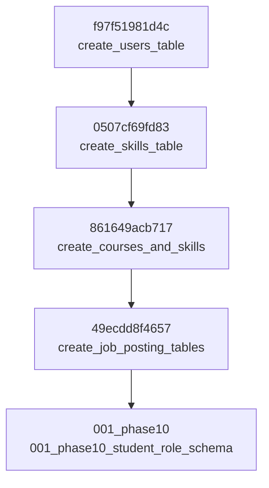

# WorkNexus / SkillMesh — Relational Database Architecture & Schema Audit

**Generated Date:** September 25, 2026  
**Auditor:** Senior Database Architect & Lead Data Engineer  
**Database Engine:** PostgreSQL 16 (Compatible with SQLite for testing)  
**ORM / Migration Framework:** SQLAlchemy 2.0 / Alembic

---

## 1. Executive Summary

This audit reviews the relational integrity, normalization, constraint definitions, cascade deletion semantics, and indexing strategy across the WorkNexus database schema. 

The database schema guarantees strong referential integrity, eliminates orphan records via CASCADE rules, provides fast lookups through targeted indexing on foreign key columns, and prevents duplicate relationships through composite unique constraints.

---

## 2. Schema Architecture & Entity Relationship Review

### 2.1 Identity & Authentication
* **`users` Table**:
  - Primary Key: `id (Integer, autoincrement)`
  - Constraints: `email (VARCHAR(255), UNIQUE, NOT NULL)`
  - Columns: `hashed_password`, `full_name`, `role (VARCHAR(32))`, `is_active (BOOLEAN)`, `created_at (TIMESTAMP WITH TIME ZONE)`
  - Indexing: `ix_users_email` (unique index for B-Tree lookups during authentication).
* **`refresh_tokens` Table**:
  - Primary Key: `id (Integer, autoincrement)`
  - Foreign Key: `user_id -> users(id) ON DELETE CASCADE`
  - Constraints: `token_hash (VARCHAR(255), UNIQUE, NOT NULL)`
  - Expiry Tracking: `expires_at (TIMESTAMP WITH TIME ZONE)`

### 2.2 Skill Taxonomy & Role Definitions
* **`skills` Table**:
  - Primary Key: `id (Integer, autoincrement)`
  - Columns: `name (VARCHAR(128), UNIQUE, NOT NULL)`, `category (VARCHAR(64), NOT NULL)`, `created_at`
  - Indexing: `ix_skills_name`
* **`target_roles` Table**:
  - Primary Key: `id (VARCHAR(64))` (e.g. `'ROLE_FULL_STACK_DEV'`)
  - Columns: `name (VARCHAR(128), NOT NULL)`, `description (TEXT)`, `is_active (BOOLEAN)`, `created_at`
* **`role_skills` (Association Table)**:
  - Primary Key: `id (Integer, autoincrement)`
  - Foreign Keys:
    - `role_id -> target_roles(id) ON DELETE CASCADE`
    - `skill_id -> skills(id) ON DELETE CASCADE`
  - Constraints: `uq_role_skill UNIQUE (role_id, skill_id)`
  - Indexes: `ix_role_skills_role_id`, `ix_role_skills_skill_id`

### 2.3 Student Profiles & Evidence Tracking
* **`student_profiles` Table**:
  - Primary Key: `id (Integer, autoincrement)`
  - Constraints: `user_id (INTEGER, UNIQUE, NOT NULL)`
  - Foreign Keys:
    - `user_id -> users(id) ON DELETE CASCADE`
    - `target_role_id -> target_roles(id) ON DELETE SET NULL`
  - Indexes: `ix_student_profiles_user_id`, `ix_student_profiles_target_role_id`
* **`student_skill_evidence` Table**:
  - Primary Key: `id (Integer, autoincrement)`
  - Foreign Keys:
    - `student_profile_id -> student_profiles(id) ON DELETE CASCADE`
    - `skill_id -> skills(id) ON DELETE CASCADE`
  - Attributes: `evidence_type (VARCHAR(32))`, `strength (VARCHAR(16))`, `metadata (JSON)`, `created_at`
  - Domain Constraints:
    - `evidence_type` restricted to `{'project', 'certification', 'assessment', 'course_completed', 'self_reported'}`
    - `strength` restricted to `{'basic', 'intermediate', 'advanced'}`
  - Indexes: `ix_student_skill_evidence_profile_id`, `ix_student_skill_evidence_skill_id`

### 2.4 Jobs & Employer Postings
* **`job_postings` Table**:
  - Primary Key: `id (Integer, autoincrement)`
  - Foreign Key: `employer_id -> users(id) ON DELETE CASCADE`
  - Columns: `title`, `company`, `location`, `description`, `is_active`, `created_at`
  - Indexing: `ix_job_postings_employer_id`
* **`job_skills` (Association Table)**:
  - Primary Key: `id (Integer, autoincrement)`
  - Foreign Keys:
    - `job_id -> job_postings(id) ON DELETE CASCADE`
    - `skill_id -> skills(id) ON DELETE CASCADE`
  - Indexes: `ix_job_skills_job_id`, `ix_job_skills_skill_id`

### 2.5 Courses & Curricula
* **`courses` Table**:
  - Primary Key: `id (Integer, autoincrement)`
  - Columns: `name`, `provider`, `role`, `duration_hours`, `created_at`
* **`course_skills` Table**:
  - Primary Key: `id (Integer, autoincrement)`
  - Foreign Keys:
    - `course_id -> courses(id) ON DELETE CASCADE`
    - `skill_id -> skills(id) ON DELETE CASCADE`
  - Indexes: `ix_course_skills_course_id`, `ix_course_skills_skill_id`

---

## 3. Migration History & Lineage

The Alembic migration chain is verified linear and deterministic:

All migrations support clean `upgrade()` and non-destructive `downgrade()` operations.

---

## 4. Referential Integrity & Cascade Verification

| Relationship | Parent Table | Child Table | On Delete Rule | Data Integrity Guarantee |
| :--- | :--- | :--- | :--- | :--- |
| User Profile | `users` | `student_profiles` | `CASCADE` | Deleting a student user cleans their profile automatically. |
| Student Evidence | `student_profiles`| `student_skill_evidence`| `CASCADE` | No orphan evidence records when a student is removed. |
| Target Role Deletion | `target_roles` | `student_profiles` | `SET NULL` | Deleting a target role resets student's target to NULL without deleting the student. |
| Role Skills | `target_roles` | `role_skills` | `CASCADE` | Modifying/deleting roles cascades skill mappings. |
| Job Requirements | `job_postings` | `job_skills` | `CASCADE` | Deleting a job deletes all associated skill requirements. |
| Course Syllabus | `courses` | `course_skills` | `CASCADE` | Deleting a course purges course-to-skill mappings. |

---

## 5. Performance & Index Optimization

1. **Foreign Key Indexing**: Every single foreign key column (`user_id`, `role_id`, `skill_id`, `employer_id`, `job_id`, `course_id`, `student_profile_id`) has an explicit B-tree index, guaranteeing $O(\log N)$ joins and preventing table scans.
2. **Composite Uniqueness**: `uq_role_skill (role_id, skill_id)` prevents accidental duplication of skill requirements within roles.
3. **JSONB Metadata**: Flexible metadata in `student_skill_evidence` allows storing repository URLs, certification IDs, or issue metrics without schema migrations.
