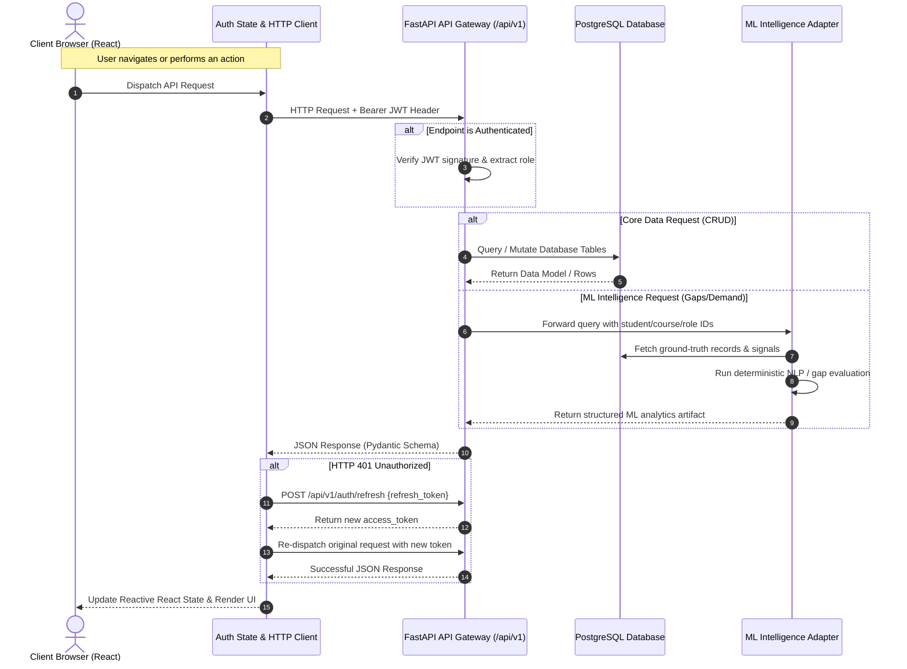
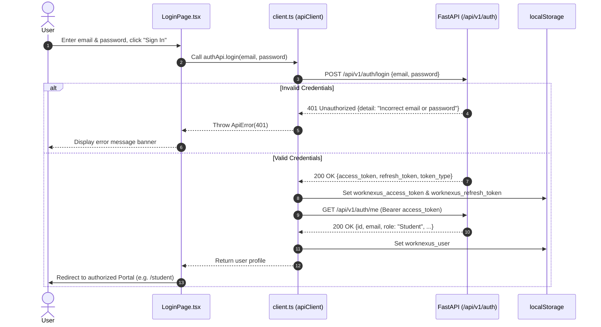

# WorkNexus Frontend Integration Guide

> **Target Audience:** Frontend Engineering Team  
> **Document Status:** Complete Source of Truth & Exhaustive API Catalog  
> **Backend Base URL:** `http://localhost:8000` (configurable via `VITE_API_URL`)  
> **API Version:** `v1` (`/api/v1/...` and root compatibility routes)

---

## 1. Project Overview

### 1.1 What is WorkNexus?
**WorkNexus** (also known as **SkillMesh**) is an enterprise labour-market intelligence and workforce curriculum-alignment platform. It bridges the gap between educational curriculum outcomes and dynamic industry hiring requirements using deterministic, multi-signal Machine Learning models.

### 1.2 Purpose of the Platform
Traditional vocational and technical education programs operate on static, multi-year curriculum cycles, while enterprise demand evolves rapidly. WorkNexus ingests job postings, extracts emerging skill requirements, analyzes student evidence portfolios, identifies curriculum gaps, and recommends targeted course interventions in real time.

### 1.3 Supported Personas

| Persona | Core Purpose | Primary Actions |
| :--- | :--- | :--- |
| **Student** | Career readiness & portfolio validation | Selects a target industry role, submits verified skill evidence (GitHub repos, certifications, proctored assessments), views calculated role readiness scores and skill gaps, and inspects recommended course curricula to close identified gaps. |
| **Employer** | Labour demand signaling & graduate feedback | Registers hiring requirements with automated skill extraction, evaluates candidates, and submits structured feedback regarding specific technical gaps observed during recruitment interviews. |
| **Institute** | Curriculum alignment & syllabus audit | Reviews registered academic and vocational courses, audits course syllabi against real-time labour market demand, and receives ML-generated curricular update directives. |
| **Trainer** | Labour market intelligence & evidence verification | Monitors live industry skill demand trajectories, examines market growth velocity, and inspects multi-signal candidate evidence distributions across industrial sectors. |
| **Admin** *(Future)* | Governance & system-wide reporting | High-level system administration, cross-district policy monitoring, and state-wide vocational analytics. *(Note: Backend endpoints for Admin are not yet provisioned; see Section 10).* |

---

## 2. Current System Architecture

### 2.1 Technology Stack
- **Frontend:** React 19, TypeScript 5, Vite 6, Tailwind CSS 4, Lucide Icons.
- **Backend:** FastAPI (Python 3.11+), Pydantic v2 schemas, SQLAlchemy ORM, Uvicorn ASGI server.
- **Database:** PostgreSQL (with SQLite compatibility for local sandbox testing).
- **ML Intelligence Engine:** Canonical skill taxonomy, TF-IDF / cosine similarity matcher, multi-signal evidence aggregation layer, deterministic curriculum and student gap analyzers.

### 2.2 End-to-End Request Flow



---

## 3. Authentication Flow

WorkNexus uses JSON Web Tokens (JWT) for stateless authentication. Both access tokens and refresh tokens are issued upon successful authentication.

### 3.1 Endpoints Specification

#### 3.1.1 Register New User
- **Route:** `POST /api/v1/auth/register`
- **Purpose:** Registers a new user with email, password, full name, and role.
- **Request Body:**
  ```json
  {
    "email": "user@worknexus.io",
    "password": "SecurePassword123!",
    "full_name": "Aarav Sharma",
    "role": "student"
  }
  ```
- **Example Response (`201 Created`):**
  ```json
  {
    "id": 101,
    "email": "user@worknexus.io",
    "full_name": "Aarav Sharma",
    "role": "Student",
    "is_active": true
  }
  ```

#### 3.1.2 Login with JSON Credentials
- **Route:** `POST /api/v1/auth/login`
- **Purpose:** Authenticates user email and password; generates JWT token pair.
- **Request Body:**
  ```json
  {
    "email": "student@worknexus.io",
    "password": "SecurePassword123!"
  }
  ```
- **Example Response (`200 OK`):**
  ```json
  {
    "access_token": "eyJhbGciOiJIUzI1NiIsInR5cCI6IkpXVCJ9...",
    "refresh_token": "def50200abc123...",
    "token_type": "bearer",
    "expires_in": 1800
  }
  ```

#### 3.1.3 OAuth2 Compatible Token Login
- **Route:** `POST /api/v1/auth/token`
- **Purpose:** OAuth2 password grant form login (used by Swagger UI documentation).
- **Request:** `application/x-www-form-urlencoded` (`username`, `password`)

#### 3.1.4 Token Refresh
- **Route:** `POST /api/v1/auth/refresh`
- **Purpose:** Rotates refresh token and returns a fresh access token.
- **Request Body:**
  ```json
  {
    "refresh_token": "def50200abc123..."
  }
  ```
- **Example Response (`200 OK`):**
  ```json
  {
    "access_token": "eyJhbGciOiJIUzI1NiIsInR5cCI6IkpXVCJ9...",
    "refresh_token": "def50200xyz789...",
    "token_type": "bearer"
  }
  ```

#### 3.1.5 Logout
- **Route:** `POST /api/v1/auth/logout`
- **Purpose:** Revokes the refresh token server-side and invalidates the session.
- **Request Body:**
  ```json
  {
    "refresh_token": "def50200xyz789..."
  }
  ```
- **Example Response (`200 OK`):**
  ```json
  {
    "message": "Successfully logged out"
  }
  ```

#### 3.1.6 Fetch Authenticated User Profile
- **Route:** `GET /api/v1/auth/me`
- **Purpose:** Retrieves the current authenticated user's identity and system role.
- **Required Header:** `Authorization: Bearer <access_token>`
- **Example Response (`200 OK`):**
  ```json
  {
    "id": 101,
    "email": "student@worknexus.io",
    "full_name": "Aarav Sharma",
    "role": "Student",
    "is_active": true
  }
  ```

### 3.2 Token Storage Strategy
- Store tokens in `localStorage` under isolated keys:
  - Access Token: `worknexus_access_token`
  - Refresh Token: `worknexus_refresh_token`
  - User Metadata: `worknexus_user` (cached user profile object)
- Clear all keys upon explicit logout or refresh rejection.

### 3.3 Automatic 401 Refresh & Retry Interceptor
The frontend HTTP client must intercept HTTP `401` errors:
1. Ignore 401 errors from `/api/v1/auth/login`, `/api/v1/auth/refresh`, or `/api/v1/auth/logout`.
2. Check if a refresh request is already pending; share a single `Promise` across concurrent requests.
3. Call `POST /api/v1/auth/refresh`.
4. If successful, persist the new token and re-dispatch original requests with `_isRetry: true`.
5. If refresh fails, call `removeAuthToken()`, clear state, and redirect user to `/login`.

---

## 4. User Roles & Permission Matrix

Roles are assigned server-side upon user registration and encoded into the JWT claim.

### 4.1 Role Definitions
- **`Student`**: Can only view StudentPortal. Can query roles, submit evidence for their own `user_id`, and run student gap analysis.
- **`Employer`**: Can only view EmployerPortal. Can post job openings and submit feedback signals.
- **`Institute`**: Can only view InstitutePortal. Can query course lists and inspect curriculum gaps.
- **`Trainer`**: Can only view TrainerHub. Can query labour market demand and inspect evidence distributions.
- **`Admin`**: Platform supervisor. Can access all 4 functional portals (`Student`, `Employer`, `Institute`, `Trainer`).

### 4.2 Role-Permission Matrix

| Endpoint / Action | Student | Employer | Institute | Trainer | Admin |
| :--- | :---: | :---: | :---: | :---: | :---: |
| `POST /api/v1/auth/login` | Allowed | Allowed | Allowed | Allowed | Allowed |
| `GET /api/v1/roles/` | Allowed | Allowed | Allowed | Allowed | Allowed |
| `GET /api/v1/students/{id}/evidence` | Own ID | Forbidden | Forbidden | Forbidden | Allowed |
| `POST /api/v1/students/{id}/evidence` | Own ID | Forbidden | Forbidden | Forbidden | Allowed |
| `GET /api/v1/ml/students/{id}/gap/{role}` | Own ID | Forbidden | Forbidden | Allowed | Allowed |
| `GET /api/v1/ml/students/{id}/course-candidates/{role}` | Own ID | Forbidden | Forbidden | Forbidden | Allowed |
| `POST /api/v1/jobs/` | Forbidden | Allowed | Forbidden | Forbidden | Allowed |
| `POST /api/v1/employers/feedback` | Forbidden | Allowed | Forbidden | Forbidden | Allowed |
| `GET /api/v1/courses/` | Allowed | Forbidden | Allowed | Allowed | Allowed |
| `GET /api/v1/ml/course-gaps/{course_id}` | Forbidden | Forbidden | Allowed | Allowed | Allowed |
| `GET /api/v1/ml/demand` | Forbidden | Forbidden | Forbidden | Allowed | Allowed |
| `GET /api/v1/ml/evidence-summary/{skill_id}`| Forbidden | Forbidden | Forbidden | Allowed | Allowed |

---

## 5. Complete API Reference

*(All routes in the backend are mounted under `/api/v1` and duplicated at root level for legacy/Swagger compatibility).*

### 5.1 Authentication Endpoints (`/api/v1/auth`)

| Method | Route | Description | Auth Required |
| :--- | :--- | :--- | :---: |
| `POST` | `/api/v1/auth/register` | Register new user account | No |
| `POST` | `/api/v1/auth/login` | Login with email and password JSON payload | No |
| `POST` | `/api/v1/auth/token` | OAuth2 password request form login (Swagger UI) | No |
| `POST` | `/api/v1/auth/refresh` | Exchange refresh token for fresh access token | No |
| `POST` | `/api/v1/auth/logout` | Revoke refresh token and terminate session | No |
| `GET` | `/api/v1/auth/me` | Fetch active authenticated user profile | Yes (Bearer) |

---

### 5.2 Career Roles Endpoints (`/api/v1/roles`)

#### `GET /api/v1/roles/`
- **Method:** `GET`
- **Purpose:** Lists all active target career roles with required benchmark skill IDs.
- **Auth:** Bearer Token
- **Response Example:**
  ```json
  [
    {
      "id": "ROLE_DATA_ENGINEER",
      "name": "Data Engineer",
      "description": "Designs, builds, and maintains data pipelines.",
      "is_active": true,
      "required_skills": ["SK_PYTHON", "SK_SQL", "SK_AIRFLOW", "SK_SPARK"],
      "created_at": "2026-01-15T10:30:00Z"
    }
  ]
  ```

#### `GET /api/v1/roles/{role_id}`
- **Method:** `GET`
- **Purpose:** Retrieves a single target career role by ID.
- **Auth:** Bearer Token

#### `POST /api/v1/roles/`
- **Method:** `POST`
- **Purpose:** Creates a new target career role with required skill IDs.
- **Auth:** Admin only
- **Request Body:**
  ```json
  {
    "id": "ROLE_ROBOTICS_TECH",
    "name": "Robotics Technician",
    "description": "Maintains industrial robotic arms.",
    "skill_ids": ["SK_ROS", "SK_PYTHON", "SK_PLC"]
  }
  ```

---

### 5.3 Student & Evidence Endpoints (`/api/v1/students`)

#### `POST /api/v1/students/profile`
- **Method:** `POST`
- **Purpose:** Creates or updates a student profile target role.
- **Request Body:**
  ```json
  {
    "user_id": 101,
    "target_role_id": "ROLE_DATA_ENGINEER"
  }
  ```

#### `GET /api/v1/students/{user_id}/profile`
- **Method:** `GET`
- **Purpose:** Retrieves a student's profile, target role, and evidence records.
- **Auth:** Student (own ID) or Admin

#### `POST /api/v1/students/{user_id}/evidence`
- **Method:** `POST`
- **Purpose:** Submits an artifact proving skill competency.
- **Auth:** Student (own ID) or Admin
- **Request Body:**
  ```json
  {
    "skill_id": "SK_SQL",
    "evidence_type": "project",
    "strength": "intermediate",
    "metadata": {
      "repo": "https://github.com/student/analytics-pipeline",
      "timestamp": "2026-02-10T14:22:00Z"
    }
  }
  ```

#### `GET /api/v1/students/{user_id}/evidence`
- **Method:** `GET`
- **Purpose:** Lists all verified evidence records submitted by a student.
- **Auth:** Student (own ID) or Admin

---

### 5.4 Jobs & Employer Endpoints (`/api/v1/jobs` & `/api/v1/employers`)

#### `POST /api/v1/jobs/`
- **Method:** `POST`
- **Purpose:** Posts an employer job opening with automated NLP skill extraction.
- **Auth:** Employer or Admin
- **Request Body:**
  ```json
  {
    "title": "Junior Data Analyst",
    "company": "Tata Technologies",
    "location": "Pune",
    "description": "Looking for junior analyst with solid SQL joins and Python scripting background."
  }
  ```
- **Response Example:**
  ```json
  {
    "id": 84,
    "title": "Junior Data Analyst",
    "company": "Tata Technologies",
    "location": "Pune",
    "description": "...",
    "employer_id": 22,
    "created_at": "2026-02-20T09:15:00Z",
    "skills": [
      { "id": 190, "skill_id": "SK_SQL", "confidence_score": 0.94 },
      { "id": 191, "skill_id": "SK_PYTHON", "confidence_score": 0.89 }
    ]
  }
  ```

#### `GET /api/v1/jobs/`
- **Method:** `GET`
- **Purpose:** Lists all submitted job postings.
- **Auth:** Authenticated users

#### `POST /api/v1/employers/feedback`
- **Method:** `POST`
- **Purpose:** Submits structured feedback on student/graduate gap signals.
- **Auth:** Employer or Admin
- **Request Body:**
  ```json
  {
    "comments": "Candidates demonstrated poor hands-on knowledge in Docker containerization and AWS setup.",
    "rating": 3,
    "course_id": 2,
    "employer_id": 22
  }
  ```

#### `GET /api/v1/employers/feedback`
- **Method:** `GET`
- **Purpose:** Lists all submitted employer feedback records.
- **Auth:** Authenticated users

---

### 5.5 Courses & Curricula Endpoints (`/api/v1/courses`)

#### `GET /api/v1/courses/`
- **Method:** `GET`
- **Purpose:** Lists all institutional courses.
- **Query Parameters:** `department`, `is_active`, `skip`, `limit`
- **Response Example:**
  ```json
  [
    {
      "id": 1,
      "title": "Advanced Electric Vehicle Powertrain Engineering",
      "code": "EV-401",
      "description": "Comprehensive study of EV traction systems.",
      "duration_weeks": 16,
      "provider": "Pune Institute of Technology",
      "is_active": true
    }
  ]
  ```

#### `GET /api/v1/courses/{id}`
- **Method:** `GET`
- **Purpose:** Retrieves course details by database primary key ID.

#### `POST /api/v1/courses/`
- **Method:** `POST`
- **Purpose:** Creates a new course record in the catalog.
- **Request Body:** `{"course_id": "EV-402", "name": "...", "department": "...", "credits": 4}`

#### `PUT /api/v1/courses/{id}`
- **Method:** `PUT`
- **Purpose:** Updates existing course attributes.

#### `DELETE /api/v1/courses/{id}`
- **Method:** `DELETE`
- **Purpose:** Deletes a course from the catalog.

#### `GET /api/v1/courses/{id}/skills`
- **Method:** `GET`
- **Purpose:** Retrieves all skills mapped to this specific course.

---

### 5.6 Machine Learning Intelligence Endpoints (`/api/v1/ml`)

#### `POST /api/v1/ml/extract-skills`
- **Method:** `POST`
- **Purpose:** Extracts canonical skills and confidence scores from raw arbitrary text.
- **Request Body:** `{"text": "Candidate must know Python, Docker, and Kubernetes."}`
- **Response Example:**
  ```json
  {
    "skills": [
      { "skill_id": "SK_PYTHON", "confidence_score": 0.95 },
      { "skill_id": "SK_DOCKER", "confidence_score": 0.91 }
    ]
  }
  ```

#### `GET /api/v1/ml/demand`
- **Method:** `GET`
- **Purpose:** Retrieves real-time aggregate market demand scores and active postings count.
- **Query Parameters:** `mode` (`"live"` or `"benchmark"`), `top_n` (integer)
- **Response Example:**
  ```json
  [
    {
      "skill_id": "SK_PYTHON",
      "demand_score": 0.94,
      "market_growth_rate": 0.28,
      "active_postings_count": 142
    }
  ]
  ```

#### `GET /api/v1/ml/course-gaps`
- **Method:** `GET`
- **Purpose:** Retrieves system-wide curriculum skill gaps across all courses.
- **Query Parameters:** `mode` (`"live"` or `"benchmark"`)

#### `GET /api/v1/ml/course-gaps/{course_id}`
- **Method:** `GET`
- **Purpose:** Computes syllabus skill gap, market coverage %, missing skills, and ML curricular directives.
- **Query Parameters:** `mode` (`"live"` or `"benchmark"`)
- **Response Example:**
  ```json
  {
    "course_id": 1,
    "gap_score": 0.28,
    "coverage_pct": 72.0,
    "missing_skills": ["SK_BMS", "SK_CAN_FD"],
    "weak_skills": ["SK_BATTERY"],
    "recommendations": [
      "Incorporate hands-on laboratory modules for high-voltage BMS balancing circuits."
    ]
  }
  ```

#### `GET /api/v1/ml/evidence`
- **Method:** `GET`
- **Purpose:** Retrieves multi-signal evidence intelligence artifact across all skills.
- **Query Parameters:** `mode` (`"live"` or `"benchmark"`)

#### `GET /api/v1/ml/evidence-summary/{skill_id}` (Alias: `/api/v1/ml/evidence/{skill_id}`)
- **Method:** `GET`
- **Purpose:** Inspects multi-signal verified evidence artifacts and candidate proficiency distribution for a single skill.
- **Response Example:**
  ```json
  {
    "skill_id": "SK_PYTHON",
    "evidence_count": 48,
    "confidence_distribution": {
      "advanced": 22,
      "intermediate": 18,
      "basic": 8
    },
    "primary_evidence_types": ["project", "certification", "assessment"],
    "employer_signal_weight": 0.91
  }
  ```

#### `GET /api/v1/ml/recommendations`
- **Method:** `GET`
- **Purpose:** Retrieves generic market skill recommendations above an optional threshold.
- **Query Parameters:** `mode`, `threshold` (float)

#### `GET /api/v1/ml/roles/{role_id}`
- **Method:** `GET`
- **Purpose:** Retrieves contextual skill recommendations for a specific role.
- **Query Parameters:** `mode` (`"live"` or `"benchmark"`)

#### `GET /api/v1/ml/students/{student_id}/profile` (Alias: `/api/v1/ml/students/{student_id}`)
- **Method:** `GET`
- **Purpose:** Retrieves ML student skill profile.
- **Query Parameters:** `mode` (`"live"` or `"benchmark"`)

#### `GET /api/v1/ml/students/{student_id}/gap/{role_id}`
- **Method:** `GET`
- **Purpose:** Computes the live match score, gap %, acquired skills, and missing skills for a student targeting a career role.
- **Query Parameters:** `mode` (`"live"` or `"benchmark"`)
- **Response Example:**
  ```json
  {
    "student_id": "STU_001",
    "role_id": "ROLE_DATA_ENGINEER",
    "mode": "benchmark",
    "overall_match_score": 0.78,
    "gap_percentage": 22.0,
    "skills_acquired": [
      { "skill_id": "SK_PYTHON", "score": 1.0, "strength": "intermediate" },
      { "skill_id": "SK_SQL", "score": 1.0, "strength": "intermediate" }
    ],
    "skills_missing": [
      { "skill_id": "SK_AIRFLOW", "importance": 1.0 }
    ]
  }
  ```

#### `GET /api/v1/ml/students/{student_id}/recommendations/{role_id}`
- **Method:** `GET`
- **Purpose:** Retrieves personalized skill recommendations for a student toward a role.
- **Query Parameters:** `mode` (`"live"` or `"benchmark"`)

#### `GET /api/v1/ml/students/{student_id}/course-candidates/{role_id}`
- **Method:** `GET`
- **Purpose:** Identifies candidate courses from the catalog that cover the student's missing skills for their target role.
- **Response Example:**
  ```json
  {
    "student_id": "STU_001",
    "role_id": "ROLE_DATA_ENGINEER",
    "candidate_courses": [
      {
        "course_id": 2,
        "course_name": "Modern Cloud Data Infrastructure & Pipelines",
        "skill_coverage_score": 0.85,
        "skills_covered": ["SK_AIRFLOW", "SK_SPARK"]
      }
    ]
  }
  ```

---

### 5.7 Direct Taxonomy & Entity CRUD Endpoints

These endpoints provide low-level database CRUD operations across the underlying tables:

#### Skills Taxonomy (`/api/v1/skills`)
- `GET /api/v1/skills/` — List all skills in taxonomy (filter by `category`, `is_active`).
- `GET /api/v1/skills/{skill_id}` — Get skill by database ID or code (e.g. `SK_SQL`).
- `POST /api/v1/skills/` — Create new skill code (`{"skill_id": "SK_GO", "name": "Golang", "category": "Languages"}`).
- `PUT /api/v1/skills/{skill_id}` — Update skill name, category, or active status.
- `DELETE /api/v1/skills/{skill_id}` — Delete a skill from taxonomy.

#### Course-Skill Mappings (`/api/v1/course-skills`)
- `GET /api/v1/course-skills/` — List course-skill mappings (filter by `course_id`, `skill_id`).
- `GET /api/v1/course-skills/course/{course_id}` — Get mappings for a specific course.
- `GET /api/v1/course-skills/{id}` — Get single course-skill mapping.
- `POST /api/v1/course-skills/` — Add a skill to course (`{"course_id": 1, "skill_id": 4, "relevance_score": 0.9}`).
- `DELETE /api/v1/course-skills/{id}` — Remove skill mapping from course.

#### Job Postings Table (`/api/v1/job-postings`)
- `GET /api/v1/job-postings` — Direct listing of job posting table records.
- `GET /api/v1/job-postings/{job_id}` — Get single job posting record.
- `POST /api/v1/job-postings` — Create direct posting record.
- `DELETE /api/v1/job-postings/{job_id}` — Delete posting record.

#### Job-Skill Mappings (`/api/v1/job-skills`)
- `GET /api/v1/job-skills` — List job skill mappings.
- `GET /api/v1/job-skills/{job_skill_id}` — Get job skill record by ID.
- `POST /api/v1/job-skills` — Map skill to job (`{"job_id": 1, "skill_id": "SK_PYTHON", "confidence_score": 0.9}`).
- `DELETE /api/v1/job-skills/{job_skill_id}` — Delete job skill mapping.

#### User Skills Profile (`/api/v1/user-skills`)
- `GET /api/v1/user-skills/me` — List skills for authenticated user.
- `GET /api/v1/user-skills/` — List user skills (optional filter `user_id`).
- `GET /api/v1/user-skills/{id}` — Get specific user skill record.
- `POST /api/v1/user-skills/` — Add skill to user (`{"skill_id": 1, "proficiency_level": "intermediate", "source": "project"}`).
- `PUT /api/v1/user-skills/{id}` — Update user skill proficiency level.
- `DELETE /api/v1/user-skills/{id}` — Remove skill from user profile.

#### Health Checks
- `GET /` — Root status endpoint: `{"status": "healthy", "service": "worknexus-backend"}`
- `GET /health` — Service health check.

---

## 6. Student Portal Specification

### 6.1 Functional Architecture
The Student Portal enables students to audit their employability against real industry role requirements, register evidence, and track curriculum remedies.

```
StudentPortal
├── Hero Section (Role aspiration summary)
├── Target Career Role Selector (Dropdown from GET /api/v1/roles/)
├── Analytics Grid (2 Columns)
│   ├── Left: Role Readiness & Gap Gauge (GET /api/v1/ml/students/{id}/gap/{role})
│   │   ├── Match Score Ring (% readiness)
│   │   ├── Skill Gap Metric (% gap)
│   │   └── Priority Missing Skills Pills
│   └── Right: Submit Skill Evidence Form & Artifacts
│       ├── Input: Skill ID, Evidence Type, Strength, Artifact URL
│       ├── Action: POST /api/v1/students/{id}/evidence
│       └── Verified Artifacts List (GET /api/v1/students/{id}/evidence)
└── Recommended Courses to Close Gap
    └── Grid of Matched Courses (GET /api/v1/ml/students/{id}/course-candidates/{role})
```

### 6.2 Component States & Handling

| Section | Loading State | Empty State | Error State |
| :--- | :--- | :--- | :--- |
| **Role Selector** | Disabled select with `Loading roles...` spinner | `No target roles returned by backend` | Fallback notice to retry |
| **Readiness Card** | Dimmed ring with spinning loader | Render `—` readiness & `Select a target role` text | Clear warning banner |
| **Evidence Submission** | Submit button disabled: `Verifying & Submitting...` | N/A | Inline toast: `Evidence submission error: <msg>` |
| **Artifacts List** | Skeleton rows | Dashed container: `No verified evidence artifacts recorded yet.` | `Unable to load evidence history` |
| **Course Recommendations**| Grid skeletons | Dashed card: `No curriculum candidates match this role gap yet.` | Notification with retry button |

---

## 7. Employer Portal Specification

### 7.1 Functional Architecture
The Employer Portal provides industry partners with a standardized interface to post job demands and provide feedback signals that directly calibrate ML models.

```
EmployerPortal
├── Header & Purpose Overview
├── Submission Success Card (Rendered after successful live API call)
│   ├── Badge: Job ID (#ID)
│   ├── Meta Details (Company, Role, Location)
│   ├── Extracted Skills List (Live NLP tags with confidence %)
│   └── Action: "Post Another Requirement"
└── Job Registration Form
    ├── Employer Details (Company name, Contact info, Industry)
    ├── Position Details (Job title, District selector)
    ├── Required Skills Tag Input (Freeform tags + quick-add suggestions)
    ├── Missing Skills in Candidates (Checklist of observed graduate gaps)
    ├── Freeform Comments (Textarea with 500-character counter)
    └── Submit CTA (Calls POST /api/v1/jobs/ and POST /api/v1/employers/feedback)
```

### 7.2 Validation & Payload Construction
1. **Frontend Validation Rules:**
   - Company Name: Required, min length 2 characters.
   - Contact Info: Required (valid email or phone format).
   - Job Role: Required, min length 2 characters.
   - District: Required (selected from approved state district list).
   - Required Skills: Must have at least 1 skill tag added.
2. **Payload Composition:**
   - Combine comments, required skills, and missing skills into `description` payload for `POST /api/v1/jobs/`.
   - Dispatch feedback signal to `POST /api/v1/employers/feedback` with `rating` and `comments`.

---

## 8. Institute Portal Specification

### 8.1 Functional Architecture
Allows academic deans and vocational directors to evaluate how effectively their institutional curricula satisfy market demand.

```
InstitutePortal
├── Portal Banner
└── Main Content (Split Layout: 1/3 and 2/3)
    ├── Left Panel: Institutional Courses Catalog
    │   ├── GET /api/v1/courses/
    │   └── Selectable Course Cards (Code, Title, Provider, Duration)
    └── Right Panel: Curriculum Analysis Report
        ├── GET /api/v1/ml/course-gaps/{course_id}
        ├── Metric Highlights:
        │   ├── Curriculum Gap Score (%)
        │   ├── Market Coverage Ratio (%)
        │   └── Identified Gap Areas (count)
        ├── Industrial Skills Missing in Syllabus (Pill badges)
        └── ML Curricular Update Directives (Actionable recommendation cards)
```

### 8.2 Component States
- **Catalog Empty State:** Displays `No courses registered in backend catalog.`
- **Gap Analysis Empty State:** When a selected course has no gap signals, displays `No ML gap data available for this course syllabus.`
- **Analyzing State:** Re-triggers subtle animated spinner (`Analyzing...`) whenever a user selects a different course from the catalog.

---

## 9. Trainer Portal Specification

### 9.1 Functional Architecture
Empowers state trainers and assessors to view live hiring demand trajectories and verify evidence distributions.

```
TrainerHub
├── Portal Header
└── Grid (2/3 Demand Ranking + 1/3 Evidence Inspector)
    ├── Left: Live Industry Skill Demand
    │   ├── GET /api/v1/ml/demand?top_n=12
    │   └── Ranked Skill Cards:
    │       ├── Demand Rank (#1, #2, ...)
    │       ├── Skill Identifier (e.g. SK_PYTHON)
    │       ├── High Growth Velocity Badge (>30% growth)
    │       ├── Demand Score Bar (%)
    │       └── Active Postings Count & YoY Velocity
    └── Right: Multi-Signal Evidence Inspector
        ├── GET /api/v1/ml/evidence-summary/{selected_skill}
        ├── Total Verified Evidence Artifacts (Count)
        ├── Strength Proficiency Spread (Advanced / Intermediate / Basic counts)
        └── Corporate Trust Index (%)
```

### 9.2 Data Handling Guidelines
- If `market_growth_rate` is missing from backend response, omit the YoY growth percentage gracefully rather than showing `NaN%`.
- If `active_postings_count` is absent, show `—` rather than fabricated values.

---

## 10. Admin Portal Status

> [!WARNING]
> **Status: NOT IMPLEMENTED IN BACKEND**  
> The backend currently contains **zero** aggregate state-level or cross-district reporting endpoints.

### 10.1 Future Endpoints Required Before Frontend Implementation
To support an enterprise Admin Portal, backend engineering must implement:
1. `GET /api/v1/admin/analytics/state-summary` (Aggregate counts of certified students, total postings, average placement rates).
2. `GET /api/v1/admin/districts/` (District-level skill gap indices and severity classifications).
3. `GET /api/v1/admin/audit-logs/` (System-wide governance logs).

### 10.2 Frontend Rule
- **Do not** build or route mock administrative dashboards.
- Users authenticated with the `Admin` role are permitted to view and inspect all 4 active portals (`Student`, `Employer`, `Institute`, `Trainer`).

---

## 11. Backend Constraints & Rules

1. **Authentication:** All private routes require the `Authorization: Bearer <access_token>` header.
2. **Standard Error Schema:** The backend returns HTTP errors in standard FastAPI JSON format:
   ```json
   {
     "detail": "Error description or array of validation errors"
   }
   ```
   The frontend `ApiError` class must parse both plain string messages and validation arrays (`loc`, `msg`, `type`).
3. **Pydantic Validation:** All JSON bodies sent from the frontend must adhere to exact field names and types (e.g., `skill_id`, `evidence_type`, `strength`).
4. **CORS:** The backend enforces CORS for origins `http://localhost:3000`, `http://localhost:5173`, and `http://127.0.0.1:*`. Production environments must set `CORS_ORIGINS` in backend environment variables.
5. **Role Capitalization:** Backend roles are standardized as capitalized strings (`Student`, `Employer`, `Institute`, `Trainer`, `Admin`). Frontend checks must use case-insensitive matching (`user.role.toLowerCase()`).

---

## 12. Frontend Development Rules

> [!IMPORTANT]
> The frontend team must adhere strictly to these engineering constraints:

- [x] **Zero Mock Policy:** Never use in-memory mock databases (e.g. `mockDb.ts`).
- [x] **No Hardcoded Fallbacks:** Do not inject synthetic percentage fallbacks (e.g., `gap_score || 0.78`). If an API returns no data, render a clean empty or error state.
- [x] **No Role Spoofing:** Do not implement client-side dropdowns that change user roles in `localStorage`. Roles are dictated solely by verified JWT claims.
- [x] **No Synthetic Auth Flows:** Do not build fake OTP timers, mock SMS verification, or non-functional "Forgot Password" modals unless backed by live endpoints.
- [x] **No Phantom Navigation:** Only expose routes that are backed by operational backend endpoints.
- [x] **Deterministic Types:** Always use TypeScript interfaces mapped directly from backend Pydantic schemas.

---

## 13. UI/UX Recommendations

*(These recommendations provide design system guidance for frontend developers without altering backend logic).*

### 13.1 Design System Palette
- **Primary:** `#4F46E5` (Indigo-600) — Main CTAs, active highlights, key metrics.
- **Secondary:** `#6366F1` (Indigo-500) — Hover states, accents.
- **Background:** `#F8FAFC` (Slate-50) — Canvas and page body.
- **Surface / Cards:** `#FFFFFF` (White) with `border border-slate-200 shadow-xs`.
- **Text Primary:** `#0F172A` (Slate-900).
- **Text Muted:** `#64748B` (Slate-500).
- **Success:** `#059669` (Emerald-600) — Low gaps, verified credentials.
- **Warning / Gap:** `#D97706` (Amber-600) — Moderate gaps, skills to acquire.
- **Danger:** `#DC2626` (Rose-600) — High skill gaps, critical deficiencies.

### 13.2 Typography & Spacing
- Use standard 8px grid scale (`p-2` = 8px, `p-4` = 16px, `p-6` = 24px, `p-8` = 32px).
- Maintain strong typographic hierarchy:
  - Page Titles: `text-2xl font-bold tracking-tight text-slate-900`
  - Card Headings: `text-base font-semibold text-slate-900`
  - Micro Labels / Badges: `text-xs font-semibold uppercase tracking-wider text-slate-500`

### 13.3 Interaction Patterns
- **Loading Skeletons:** Use pulse skeletons (`animate-pulse bg-slate-200 rounded`) matching exact card dimensions while awaiting asynchronous fetches.
- **Empty States:** Provide friendly, actionable empty states with clear iconography and descriptive copy rather than blank whitespace.
- **Toasts:** Use toast notifications for mutation confirmations (e.g., evidence submitted, job requirement registered).

---

## 14. Frontend Integration Checklist

Use this checklist to verify production integration readiness before deployment:

### Authentication & Security
- [ ] Login screen submits credentials exclusively to `POST /api/v1/auth/login`
- [ ] Access token and refresh token saved securely in client storage
- [ ] HTTP client includes `Authorization: Bearer <token>` on all requests
- [ ] Automatic 401 interceptor rotates refresh token via `POST /api/v1/auth/refresh`
- [ ] Client logs out and clears storage if refresh token is rejected
- [ ] Unauthenticated users are redirected to `/login` when accessing portal routes

### Role-Based Routing
- [ ] `Student` user cannot access Employer, Institute, or Trainer screens
- [ ] `Employer` user cannot access Student, Institute, or Trainer screens
- [ ] `Institute` user cannot access Student, Employer, or Trainer screens
- [ ] `Trainer` user cannot access Student, Employer, or Institute screens
- [ ] `Admin` user can inspect all active portals

### Student Portal Integration
- [ ] Target role selector populated from `GET /api/v1/roles/`
- [ ] Verified evidence records loaded from `GET /api/v1/students/{id}/evidence`
- [ ] Evidence creation form dispatches to `POST /api/v1/students/{id}/evidence`
- [ ] Gap score and missing skills calculated via `GET /api/v1/ml/students/{id}/gap/{role}`
- [ ] Curriculum candidates populated via `GET /api/v1/ml/students/{id}/course-candidates/{role}`
- [ ] Proper empty states display when evidence or course candidates are empty

### Employer Portal Integration
- [ ] Job submission form dispatches to `POST /api/v1/jobs/`
- [ ] Extracted skills from job creation response render with confidence percentages
- [ ] Feedback signal dispatches to `POST /api/v1/employers/feedback`
- [ ] Success state displays returned database Job ID

### Institute Portal Integration
- [ ] Course list loaded dynamically from `GET /api/v1/courses/`
- [ ] Selecting course triggers `GET /api/v1/ml/course-gaps/{course_id}`
- [ ] Missing competencies and ML curricular directives display accurately

### Trainer Portal Integration
- [ ] Market demand list populated from `GET /api/v1/ml/demand`
- [ ] Selecting a skill calls `GET /api/v1/ml/evidence-summary/{skill_id}`
- [ ] Proficiency spread and Corporate Trust Index reflect API values

### Code Quality & Build
- [ ] All TypeScript checks pass (`npx tsc --noEmit` returns exit code 0)
- [ ] Production build succeeds (`npm run build` returns exit code 0)
- [ ] Zero mock data files or synthetic generators exist in the codebase

---

## 15. Appendix

### 15.1 Complete Master Endpoint Inventory Table (100% of Backend & ML Routes)

| Category | Method | Route | Authentication | Access / Allowed Roles |
| :--- | :--- | :--- | :---: | :--- |
| **System** | `GET` | `/` | No | Public (Health metadata) |
| **System** | `GET` | `/health` | No | Public (Service health status) |
| **Auth** | `POST` | `/api/v1/auth/register` | No | Public (Account creation) |
| **Auth** | `POST` | `/api/v1/auth/login` | No | Public (JSON credentials) |
| **Auth** | `POST` | `/api/v1/auth/token` | No | Public (OAuth2 form grant) |
| **Auth** | `POST` | `/api/v1/auth/refresh` | No | Public (Refresh token required) |
| **Auth** | `POST` | `/api/v1/auth/logout` | No | Public (Revoke refresh token) |
| **Auth** | `GET` | `/api/v1/auth/me` | Yes | All Authenticated Users |
| **Roles** | `GET` | `/api/v1/roles/` | Yes | All Authenticated Users |
| **Roles** | `GET` | `/api/v1/roles/{role_id}` | Yes | All Authenticated Users |
| **Roles** | `POST` | `/api/v1/roles/` | Yes | Admin Only |
| **Students** | `POST` | `/api/v1/students/profile` | Yes | Student (Self), Admin |
| **Students** | `GET` | `/api/v1/students/{user_id}/profile` | Yes | Student (Self), Admin |
| **Students** | `POST` | `/api/v1/students/{user_id}/evidence` | Yes | Student (Self), Admin |
| **Students** | `GET` | `/api/v1/students/{user_id}/evidence` | Yes | Student (Self), Admin |
| **Jobs** | `POST` | `/api/v1/jobs/` | Yes | Employer, Admin |
| **Jobs** | `GET` | `/api/v1/jobs/` | Yes | All Authenticated Users |
| **Employers**| `POST` | `/api/v1/employers/feedback` | Yes | Employer, Admin |
| **Employers**| `GET` | `/api/v1/employers/feedback` | Yes | All Authenticated Users |
| **Courses** | `GET` | `/api/v1/courses/` | Yes | All Authenticated Users |
| **Courses** | `GET` | `/api/v1/courses/{id}` | Yes | All Authenticated Users |
| **Courses** | `POST` | `/api/v1/courses/` | Yes | Institute, Admin |
| **Courses** | `PUT` | `/api/v1/courses/{id}` | Yes | Institute, Admin |
| **Courses** | `DELETE` | `/api/v1/courses/{id}` | Yes | Institute, Admin |
| **Courses** | `GET` | `/api/v1/courses/{id}/skills` | Yes | All Authenticated Users |
| **Course Skills** | `GET` | `/api/v1/course-skills/` | Yes | All Authenticated Users |
| **Course Skills** | `GET` | `/api/v1/course-skills/course/{course_id}` | Yes | All Authenticated Users |
| **Course Skills** | `GET` | `/api/v1/course-skills/{id}` | Yes | All Authenticated Users |
| **Course Skills** | `POST` | `/api/v1/course-skills/` | Yes | Institute, Admin |
| **Course Skills** | `DELETE` | `/api/v1/course-skills/{id}` | Yes | Institute, Admin |
| **Skills** | `GET` | `/api/v1/skills/` | Yes | All Authenticated Users |
| **Skills** | `GET` | `/api/v1/skills/{skill_id}` | Yes | All Authenticated Users |
| **Skills** | `POST` | `/api/v1/skills/` | Yes | Admin Only |
| **Skills** | `PUT` | `/api/v1/skills/{skill_id}` | Yes | Admin Only |
| **Skills** | `DELETE` | `/api/v1/skills/{skill_id}` | Yes | Admin Only |
| **Job Postings** | `GET` | `/api/v1/job-postings` | Yes | All Authenticated Users |
| **Job Postings** | `GET` | `/api/v1/job-postings/{job_id}` | Yes | All Authenticated Users |
| **Job Postings** | `POST` | `/api/v1/job-postings` | Yes | Employer, Admin |
| **Job Postings** | `DELETE` | `/api/v1/job-postings/{job_id}` | Yes | Employer, Admin |
| **Job Skills** | `GET` | `/api/v1/job-skills` | Yes | All Authenticated Users |
| **Job Skills** | `GET` | `/api/v1/job-skills/{job_skill_id}` | Yes | All Authenticated Users |
| **Job Skills** | `POST` | `/api/v1/job-skills` | Yes | Employer, Admin |
| **Job Skills** | `DELETE` | `/api/v1/job-skills/{job_skill_id}` | Yes | Employer, Admin |
| **User Skills** | `GET` | `/api/v1/user-skills/me` | Yes | Student (Self), Admin |
| **User Skills** | `GET` | `/api/v1/user-skills/` | Yes | Student (Self), Admin |
| **User Skills** | `GET` | `/api/v1/user-skills/{id}` | Yes | Student (Self), Admin |
| **User Skills** | `POST` | `/api/v1/user-skills/` | Yes | Student (Self), Admin |
| **User Skills** | `PUT` | `/api/v1/user-skills/{id}` | Yes | Student (Self), Admin |
| **User Skills** | `DELETE` | `/api/v1/user-skills/{id}` | Yes | Student (Self), Admin |
| **ML Engine**| `POST` | `/api/v1/ml/extract-skills` | Yes | All Authenticated Users |
| **ML Engine**| `GET` | `/api/v1/ml/demand` | Yes | Trainer, Admin |
| **ML Engine**| `GET` | `/api/v1/ml/course-gaps` | Yes | Institute, Trainer, Admin |
| **ML Engine**| `GET` | `/api/v1/ml/course-gaps/{course_id}` | Yes | Institute, Trainer, Admin |
| **ML Engine**| `GET` | `/api/v1/ml/evidence` | Yes | Trainer, Admin |
| **ML Engine**| `GET` | `/api/v1/ml/evidence-summary/{skill_id}` | Yes | Trainer, Admin |
| **ML Engine**| `GET` | `/api/v1/ml/recommendations` | Yes | All Authenticated Users |
| **ML Engine**| `GET` | `/api/v1/ml/roles/{role_id}` | Yes | All Authenticated Users |
| **ML Engine**| `GET` | `/api/v1/ml/students/{student_id}/profile`| Yes | Student (Self), Trainer, Admin |
| **ML Engine**| `GET` | `/api/v1/ml/students/{student_id}/gap/{role_id}` | Yes | Student (Self), Trainer, Admin |
| **ML Engine**| `GET` | `/api/v1/ml/students/{student_id}/recommendations/{role_id}` | Yes | Student (Self), Admin |
| **ML Engine**| `GET` | `/api/v1/ml/students/{student_id}/course-candidates/{role_id}` | Yes | Student (Self), Admin |

---

### 15.2 Authentication Sequence Diagram



---

### 15.3 Frontend-to-Backend Interaction Diagram

```mermaid
flowchart TD
    subgraph Browser ["Frontend Client (React + Vite)"]
        UI_Login["LoginPage"]
        UI_Student["StudentPortal"]
        UI_Employer["EmployerPortal"]
        UI_Institute["InstitutePortal"]
        UI_Trainer["TrainerHub"]
        HTTP_Client["apiClient (Bearer Token + 401 Interceptor)"]
    end

    subgraph Backend_Gateway ["FastAPI Core Services (/api/v1)"]
        AUTH_SVC["Auth Service"]
        ROLE_SVC["Role Service"]
        STUDENT_SVC["Student Service"]
        JOB_SVC["Job Service"]
        EMPLOYER_SVC["Employer Service"]
        COURSE_SVC["Course Service"]
    end

    subgraph ML_Engine ["Deterministic ML Layer"]
        ML_EXTRACT["Skill Extractor (NLP)"]
        ML_DEMAND["Demand Aggregator"]
        ML_GAP_COURSE["Course Gap Analyzer"]
        ML_GAP_STUDENT["Student Gap Analyzer"]
        ML_EVIDENCE["Evidence Aggregator"]
        ML_CANDIDATES["Course Candidate Recommender"]
    end

    subgraph Persistence ["Relational Database"]
        DB[(PostgreSQL)]
    end

    UI_Login --> HTTP_Client
    UI_Student --> HTTP_Client
    UI_Employer --> HTTP_Client
    UI_Institute --> HTTP_Client
    UI_Trainer --> HTTP_Client

    HTTP_Client -->|POST /auth/login| AUTH_SVC
    HTTP_Client -->|GET /roles/| ROLE_SVC
    HTTP_Client -->|GET,POST /students/.../evidence| STUDENT_SVC
    HTTP_Client -->|POST /jobs/| JOB_SVC
    HTTP_Client -->|POST /employers/feedback| EMPLOYER_SVC
    HTTP_Client -->|GET /courses/| COURSE_SVC

    HTTP_Client -->|GET /ml/demand| ML_DEMAND
    HTTP_Client -->|GET /ml/course-gaps/{id}| ML_GAP_COURSE
    HTTP_Client -->|GET /ml/evidence-summary/{id}| ML_EVIDENCE
    HTTP_Client -->|GET /ml/students/{id}/gap/{role}| ML_GAP_STUDENT
    HTTP_Client -->|GET /ml/students/{id}/course-candidates/{role}| ML_CANDIDATES

    JOB_SVC --> ML_EXTRACT
    EMPLOYER_SVC --> ML_EXTRACT

    AUTH_SVC --> DB
    ROLE_SVC --> DB
    STUDENT_SVC --> DB
    JOB_SVC --> DB
    EMPLOYER_SVC --> DB
    COURSE_SVC --> DB
    ML_DEMAND --> DB
    ML_GAP_COURSE --> DB
    ML_GAP_STUDENT --> DB
    ML_EVIDENCE --> DB
    ML_CANDIDATES --> DB
```
