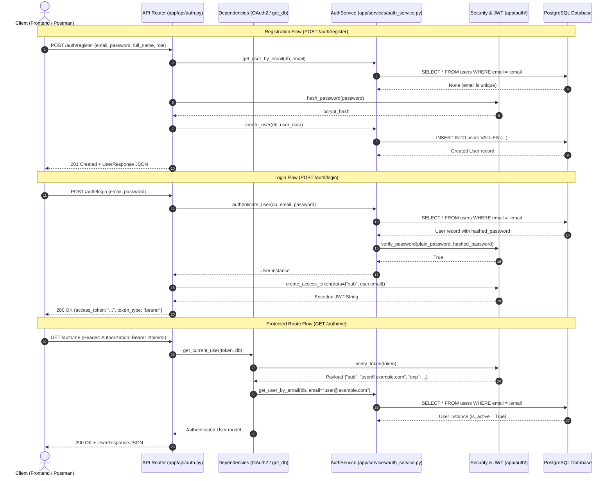
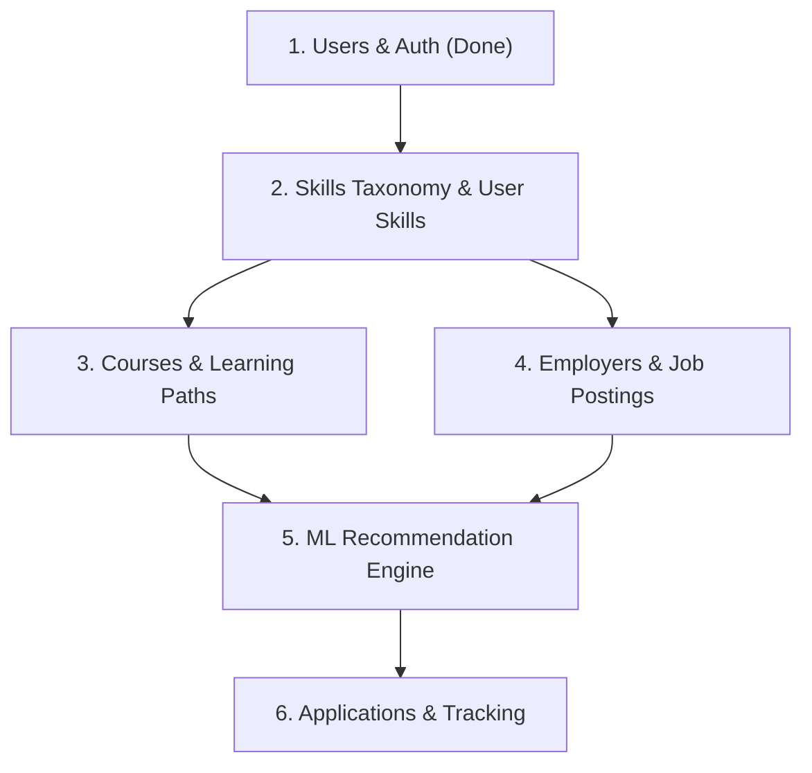

# WorkNexus Backend Architecture Guide

> **Target Audience:** Backend Developers, Machine Learning Engineers, and System Architects joining the WorkNexus / SkillSync project.  
> **Status:** Active Development (Authentication & Core Database Foundation Implemented)  
> **Repository:** `Worknexus` | **Backend Core:** `backend/`

---

## 1. Project Overview

### What is WorkNexus (SkillSync)?
WorkNexus (internally referred to as **SkillSync**) is an AI-powered talent, skill assessment, and opportunity matching platform. It bridges the gap between students/job-seekers, educational institutes, and industry employers through:
- **Skill Mapping & Gap Analysis:** Profiling user competencies against market demands.
- **Personalized Learning Pathways:** Recommending curated courses to bridge verified skill deficits.
- **Intelligent Job Matching:** Connecting candidates to relevant job postings based on skill graphs and machine learning recommendation models.

### Current Backend Status
The backend provides a solid, production-grade foundation:
- **Relational Database Management:** PostgreSQL using **SQLAlchemy 2.0** with strict Mapped type annotations and **psycopg3** (v3) driver.
- **Database Migrations:** Configured and automated via **Alembic** (`users` table fully versioned).
- **Security & Authentication:** Cryptographically verified password hashing via **Passlib (bcrypt)**, token generation and verification via **python-jose**, and standard token extraction via FastAPI's **OAuth2PasswordBearer**.
- **Validated Endpoints:** User registration (`POST /auth/register`), authentication login (`POST /auth/login`), and authenticated profile retrieval (`GET /auth/me`).
- **Clean Layered Architecture:** Strict segregation of API routers, service layers, schemas, database models, and authentication dependencies.

### Tech Stack
| Component | Technology | Version | Purpose |
| :--- | :--- | :--- | :--- |
| **Web Framework** | FastAPI | `0.141.1` | High-performance asynchronous REST API framework |
| **ASGI Server** | Uvicorn | `0.52.4` | Production ASGI web server |
| **Database** | PostgreSQL | 15+ | Primary relational database |
| **ORM** | SQLAlchemy | `2.0.52` | Python SQL toolkit and Object Relational Mapper (2.0 declarative style) |
| **DB Driver** | psycopg (psycopg3) | `3.3.5` | Modern PostgreSQL DBAPI driver for Python |
| **Migrations** | Alembic | `1.20.0` | Database schema revision management |
| **Data Validation** | Pydantic | `2.13.5` | Request parsing, data validation, and response serialization |
| **Settings** | Pydantic-Settings | `2.15.0` | Environment variable parsing from `.env` |
| **Password Hashing**| Passlib (bcrypt) | `1.7.4` | Salted one-way password hashing |
| **JWT Tokens** | python-jose | `3.5.0` | RFC 7519 JSON Web Token encoding and signature verification |

---

## 2. Folder Structure & File Responsibilities

The backend enforces a clean architecture where concerns are segregated into distinct modules.

```text
backend/
├── alembic/                         # Database migration scripts and configuration
│   ├── versions/                    # Timestamped migration revision files
│   │   └── f97f51981d4c_create_users_table.py  # Initial migration for users table
│   ├── env.py                       # Alembic migration engine and metadata loader
│   ├── README                       # Alembic environment documentation
│   └── script.py.mako               # Template for auto-generated migration files
├── app/                             # Core application package
│   ├── api/                         # HTTP routing layer (request/response orchestration)
│   │   ├── __init__.py
│   │   └── auth.py                  # Authentication routes (/register, /login, /me)
│   ├── auth/                        # Security and cryptographic primitives
│   │   ├── __init__.py              # Re-exports security, jwt, and dependency functions
│   │   ├── dependencies.py          # FastAPI OAuth2 dependencies (get_current_user)
│   │   ├── jwt.py                   # JWT creation, signing, and verification utilities
│   │   └── security.py              # Bcrypt password hashing and verification
│   ├── db/                          # Database connection and session management
│   │   ├── __init__.py
│   │   ├── base.py                  # SQLAlchemy DeclarativeBase base model class
│   │   ├── database.py              # Engine creation and SessionLocal session factory
│   │   └── dependencies.py          # FastAPI database session dependency (get_db)
│   ├── models/                      # SQLAlchemy ORM persistent domain models
│   │   ├── __init__.py              # Exposes models for Alembic autogenerate
│   │   └── users.py                 # User SQLAlchemy table definition
│   ├── schemas/                     # Pydantic validation and serialization models
│   │   ├── __init__.py              # Re-exports all request/response schemas
│   │   ├── token.py                 # Token and TokenData schemas
│   │   └── user.py                  # UserCreate, UserLogin, and UserResponse schemas
│   ├── services/                    # Business logic and database query operations
│   │   ├── __init__.py
│   │   └── auth_service.py          # User management and authentication query methods
│   ├── utils/                       # Shared utility helpers and common formatting
│   │   └── __init__.py
│   ├── config.py                    # Pydantic BaseSettings loading environment configurations
│   ├── main.py                      # FastAPI application entrypoint and router mounting
│   └── test_db.py                   # Ad-hoc database connectivity verification script
├── tests/                           # Unit and integration test suites
│   ├── test_auth_api.py             # Auth endpoints and dependency unit tests
│   └── test_auth_jwt.py             # JWT generation and validation unit tests
├── .env                             # Local secrets and configuration (git-ignored)
├── .env.example                     # Environment template for developers and deployments
├── alembic.ini                      # Alembic CLI runtime settings
└── requirements.txt                 # Exact pinned dependencies
```

### Detailed Responsibility of Each File

- **`app/main.py`**: Initializes the top-level `FastAPI` application instance (`app`), attaches global middleware, mounts routers (such as `app.include_router(auth_router)`), and exposes health-check routes.
- **`app/config.py`**: Declares the `Settings` class inheriting `pydantic_settings.BaseSettings`. Safely parses database parameters and authentication secrets from `.env`.
- **`app/db/base.py`**: Defines `class Base(DeclarativeBase)`. All ORM models inherit from this class so Alembic can detect them for migrations.
- **`app/db/database.py`**: Instantiates the SQLAlchemy `engine` using psycopg3 and creates `SessionLocal = sessionmaker(bind=engine)`.
- **`app/db/dependencies.py`**: Contains `get_db()`, the generator dependency that produces an isolated `Session` per incoming HTTP request and guarantees closure in a `finally` block.
- **`app/models/users.py`**: Defines the `User` ORM entity mapped to PostgreSQL table `users`.
- **`app/schemas/user.py`**: Contains Pydantic models for user input validation (`UserCreate`, `UserLogin`) and output serialization (`UserResponse`).
- **`app/schemas/token.py`**: Contains Pydantic models for JWT token responses (`Token`) and decoded payloads (`TokenData`).
- **`app/auth/security.py`**: Wraps `passlib.context.CryptContext` using `bcrypt` for one-way password hashing (`hash_password`) and verification (`verify_password`).
- **`app/auth/jwt.py`**: Implements `create_access_token` and `verify_token` using `python-jose`.
- **`app/auth/dependencies.py`**: Contains `oauth2_scheme = OAuth2PasswordBearer(tokenUrl="/auth/login")` and the `get_current_user` dependency.
- **`app/services/auth_service.py`**: Encapsulates all database interactions for users: creating accounts, looking up by email or ID, and verifying credentials.
- **`app/api/auth.py`**: The API controller declaring routes `/auth/register`, `/auth/login`, and `/auth/me`. Translates HTTP requests to service calls.
- **`alembic/env.py`**: Connects Alembic migrations to the application's `settings.DATABASE_URL` and `Base.metadata`.

---

## 3. Authentication & Authorization Flow

Authentication uses standard OAuth2 Bearer Tokens signed with JSON Web Tokens (JWT) using the HMAC-SHA256 (`HS256`) algorithm.

### Complete Authentication Sequence Diagram



### Detailed Flow Descriptions

#### 1. Registration Flow (`POST /auth/register`)
1. Client sends JSON payload validated against `UserCreate` schema (`email`, `password`, `full_name`, `role`).
2. The router queries `AuthService.get_user_by_email(db, email)`. If a record exists, an HTTP `400 Bad Request` ("Email already registered") is raised.
3. Plaintext password is hashed using `hash_password(user_data.password)` via `passlib` with salt rounds handled automatically by bcrypt.
4. An ORM `User` instance is instantiated, persisted via `db.add(user)` and `db.commit()`, and refreshed with its autoincremented `id` and timestamps.
5. The router returns the created user, automatically serialized into the `UserResponse` schema (omitting `hashed_password`).

#### 2. Login Flow (`POST /auth/login`)
1. Client submits credentials conforming to `UserLogin` (`email`, `password`).
2. `AuthService.authenticate_user(db, email, password)` executes a SQLAlchemy 2.0 select:
   ```python
   stmt = select(User).where(User.email == email)
   user = db.execute(stmt).scalar_one_or_none()
   ```
3. If no user exists, or if `verify_password(password, user.hashed_password)` returns `False`, an HTTP `401 Unauthorized` is returned with header `WWW-Authenticate: Bearer`.
4. If the user account has `is_active == False`, an HTTP `400 Bad Request` ("Inactive user account") is returned.
5. `create_access_token(data={"sub": user.email})` creates a signed JWT containing:
   - `sub` (Subject): The user's unique email.
   - `iat` (Issued At): Current UTC timestamp.
   - `exp` (Expiration): UTC timestamp calculated as `now + ACCESS_TOKEN_EXPIRE_MINUTES`.
6. Returns `Token(access_token=..., token_type="bearer")`.

#### 3. Token Verification & Protected Route Dependency (`get_current_user`)
1. In protected endpoints (e.g. `GET /auth/me`), the dependency `token: str = Depends(oauth2_scheme)` intercepts the HTTP `Authorization: Bearer <token>` header.
2. `verify_token(token)` calls `jose.jwt.decode(token, settings.SECRET_KEY, algorithms=[settings.ALGORITHM])`.
3. If decoding fails due to an invalid signature, expired timestamp, or malformed structure, a `401 Unauthorized` exception is thrown immediately.
4. The token's subject (`email = payload.get("sub")`) is extracted.
5. The user is loaded fresh from the database using `AuthService.get_user_by_email(db, email)`. If not found, a `401 Unauthorized` exception is thrown.
6. The fully typed `User` model instance is injected directly into the route handler.

---

## 4. Database Architecture & Migrations

### SQLAlchemy 2.0 Configuration
The backend uses modern SQLAlchemy 2.0 idioms. Legacy SQLAlchemy 1.x constructs (such as `db.query(User)`) are avoided in favor of explicit `select()` statements.

- **Base Model (`app/db/base.py`):**
  ```python
  from sqlalchemy.orm import DeclarativeBase

  class Base(DeclarativeBase):
      pass
  ```
- **Connection Engine (`app/db/database.py`):**
  ```python
  from sqlalchemy import create_engine
  from sqlalchemy.orm import sessionmaker
  from app.config import settings

  engine = create_engine(settings.DATABASE_URL)
  SessionLocal = sessionmaker(autocommit=False, autoflush=False, bind=engine)
  ```
- **Session Lifecycle (`app/db/dependencies.py`):**
  ```python
  from app.db.database import SessionLocal

  def get_db():
      db = SessionLocal()
      try:
          yield db
      finally:
          db.close()
  ```

### Alembic Migration Management
Alembic tracks database changes declaratively.

- **`alembic/env.py` Integration:**
  Reads database credentials directly from `app.config.settings` and imports `Base.metadata` from `app.db.base`.
- **Common Migration Commands:**
  - Generate a new migration after updating models:
    ```bash
    alembic revision --autogenerate -m "describe_changes_here"
    ```
  - Apply migrations to the database:
    ```bash
    alembic upgrade head
    ```
  - Roll back the most recent migration:
    ```bash
    alembic downgrade -1
    ```

---

## 5. User System & Data Model

### SQLAlchemy Model: `app/models/users.py`
```python
class User(Base):
    __tablename__ = "users"

    id: Mapped[int] = mapped_column(primary_key=True, index=True)
    email: Mapped[str] = mapped_column(String(255), unique=True, index=True, nullable=False)
    hashed_password: Mapped[str] = mapped_column(String(255), nullable=False)
    full_name: Mapped[str] = mapped_column(String(255), nullable=False)
    role: Mapped[str] = mapped_column(String(50), nullable=False)
    is_active: Mapped[bool] = mapped_column(Boolean, default=True, nullable=False)
    created_at: Mapped[datetime] = mapped_column(
        DateTime(timezone=True),
        default=lambda: datetime.now(UTC),
        nullable=False,
    )
```

### Fields Explanation
| Column | Type | Constraints | Description |
| :--- | :--- | :--- | :--- |
| `id` | `Integer` | Primary Key, Indexed | Auto-incrementing identifier for the user record. |
| `email` | `String(255)` | Unique, Indexed, Non-null | Primary contact and login credential. Validated by Pydantic's `EmailStr`. |
| `hashed_password` | `String(255)` | Non-null | Secure one-way bcrypt digest with automatic salt. Never exposed to clients. |
| `full_name` | `String(255)` | Non-null | Full legal or display name of the user. |
| `role` | `String(50)` | Non-null | System role for access control. |
| `is_active` | `Boolean` | Default: `True`, Non-null | Account status flag. Deactivated users cannot log in or access protected APIs. |
| `created_at` | `DateTime(tz=True)` | Non-null | UTC timestamp recorded at user registration. |

### Role Explanation
The `role` field specifies the permissions and workflow assigned to the account:
- `"student"` / `"jobseeker"`: Consumes skill assessments, views personalized course suggestions, applies to job postings.
- `"employer"`: Creates company profiles, posts job openings, inspects candidate skill profiles.
- `"instructor"` / `"institute"`: Publishes courses, verifies certifications, defines syllabus skill mappings.
- `"admin"`: Platform administrative control, user moderation, system-wide analytics.

---

## 6. End-to-End Request Lifecycle

Every request follows a unidirectional data flow:

```text
HTTP Request
     ↓
FastAPI Dependency Resolution (OAuth2 token extraction, DB session binding)
     ↓
Router (app/api/auth.py) - Input validation against Pydantic schema
     ↓
Service Layer (app/services/auth_service.py) - Business logic & DB queries
     ↓
SQLAlchemy ORM (app/models/users.py) - Executes SQL via psycopg3 engine
     ↓
PostgreSQL Database
     ↓
Pydantic Serialization (app/schemas/user.py) - Filters internal fields (strips password)
     ↓
HTTP Response (JSON + Status Code)
```

### Detailed Lifecycle Steps:
1. **Transport & Entry:** An HTTP request enters Uvicorn and is mapped to an endpoint defined in `app/api/`.
2. **Dependency Resolution:** FastAPI executes all `Depends(...)` declarations in parallel or dependency order:
   - `get_db` opens a database session for this request.
   - `get_current_user` extracts the `Authorization` header, parses and verifies the JWT, and loads the active user.
3. **Pydantic Validation:** The request body is deserialized and checked against schemas in `app/schemas/`. If validation fails, FastAPI returns an HTTP `422 Unprocessable Entity` response with field errors.
4. **Service Execution:** The router delegates to a static method in `app/services/`. Routers do not construct raw SQL or manipulate database models directly.
5. **Database Transaction:** The service layer executes SQLAlchemy 2.0 query statements against the database.
6. **Output Transformation:** The return value is validated and mapped against `response_model` (e.g., `UserResponse` with `from_attributes=True`), guaranteeing internal data such as `hashed_password` is never leaked.
7. **Cleanup:** Once the response stream starts, the generator in `get_db` executes its `finally:` block, closing `db` and returning the connection to the connection pool.

---

## 7. Configuration System

Configuration is driven by a single `.env` file at the root of `backend/`, loaded and validated by Pydantic's `Settings` object in [`backend/app/config.py`](file:///C:/Users/vasista0305/OneDrive/Desktop/Worknexus/backend/app/config.py).

### Environment Variables
```env
# Database Connectivity
DB_USER=postgres
DB_PASSWORD=your_password
DB_HOST=localhost
DB_PORT=5432
DB_NAME=SkillSync

# JWT Authentication
SECRET_KEY=60e03a895f64817abbecb8152cb9bcb847f5905a1c9b8215c62ef123052ac6e0
ALGORITHM=HS256
ACCESS_TOKEN_EXPIRE_MINUTES=30
```

### Settings Implementation (`app/config.py`)
```python
from urllib.parse import quote_plus
from pydantic_settings import BaseSettings, SettingsConfigDict

class Settings(BaseSettings):
    DB_USER: str
    DB_PASSWORD: str
    DB_HOST: str
    DB_PORT: int
    DB_NAME: str

    SECRET_KEY: str
    ALGORITHM: str = "HS256"
    ACCESS_TOKEN_EXPIRE_MINUTES: int = 30

    model_config = SettingsConfigDict(env_file=".env", extra="ignore")

    @property
    def DATABASE_URL(self) -> str:
        password = quote_plus(self.DB_PASSWORD)
        return (
            f"postgresql+psycopg://"
            f"{self.DB_USER}:{password}"
            f"@{self.DB_HOST}:{self.DB_PORT}/{self.DB_NAME}"
        )

settings = Settings()
```

### How to Use Settings Across Modules
Import `settings` anywhere configuration values are needed:
```python
from app.config import settings

# Example usage
token_life = settings.ACCESS_TOKEN_EXPIRE_MINUTES
secret = settings.SECRET_KEY
```

---

## 8. Dependency Injection System

FastAPI's dependency injection system decouples state and resource management from route logic.

### 1. Database Dependency (`get_db`)
Located in [`backend/app/db/dependencies.py`](file:///C:/Users/vasista0305/OneDrive/Desktop/Worknexus/backend/app/db/dependencies.py):
```python
def get_db():
    db = SessionLocal()
    try:
        yield db
    finally:
        db.close()
```
Usage in routers:
```python
@router.post("/example")
def example_endpoint(db: Session = Depends(get_db)):
    ...
```

### 2. Authentication Dependency (`get_current_user`)
Located in [`backend/app/auth/dependencies.py`](file:///C:/Users/vasista0305/OneDrive/Desktop/Worknexus/backend/app/auth/dependencies.py):
```python
oauth2_scheme = OAuth2PasswordBearer(tokenUrl="/auth/login")

def get_current_user(
    token: str = Depends(oauth2_scheme),
    db: Session = Depends(get_db),
) -> User:
    ...
```
Usage in protected routers:
```python
@router.get("/protected")
def protected_endpoint(current_user: User = Depends(get_current_user)):
    return {"message": f"Hello, {current_user.full_name}"}
```

---

## 9. How Future Modules Should Integrate

This section is designed specifically for **ML engineers** and **backend developers** adding new features to WorkNexus.

```text
               ┌───────────────────────────────┐
               │    FastAPI Application Core   │
               │        (app/main.py)          │
               └───────────────┬───────────────┘
                               │ mounts
         ┌─────────────────────┼─────────────────────┐
         ▼                     ▼                     ▼
┌────────────────┐   ┌───────────────────┐   ┌───────────────┐
│ app/api/auth.py│   │ app/api/skills.py │   │app/api/jobs.py│
└───────┬────────┘   └─────────┬─────────┘   └───────┬───────┘
        │                      │                     │
        ▼                      ▼                     ▼
┌────────────────┐   ┌───────────────────┐   ┌───────────────┐
│  AuthService   │   │   SkillService    │   │  JobService   │
└───────┬────────┘   └─────────┬─────────┘   └───────┬───────┘
        │                      │                     │
        │                      ▼                     │
        │            ┌───────────────────┐           │
        │            │     MLService     │◄──────────┘
        │            │ (Model Inference) │
        │            └─────────┬─────────┘
        │                      │
        ▼                      ▼
┌────────────────────────────────────────────────────────────┐
│                  PostgreSQL Database Layer                 │
│      (users, skills, courses, jobs, recommendations)       │
└────────────────────────────────────────────────────────────┘
```

### 1. Machine Learning (ML) Integration
- **Code Placement:** 
  - Place heavy offline ML pipelines, training notebooks, and dataset preprocessing in the top-level `ml/` and `datasets/` folders.
  - Wrap model inference and runtime scoring inside `backend/app/services/ml_service.py` or dedicated submodules (e.g. `backend/app/ml/`).
- **Inference Pattern:**
  - Export trained models to fast serialization formats (e.g. `joblib`, `onnx`, or `torchscript`).
  - Load the model artifact **once** during FastAPI application startup (using a lifespan handler in `main.py`) rather than reloading per request.
  - Store model representations (e.g., skill embeddings or user profile vectors) in PostgreSQL (using `pgvector` or indexed JSONB columns).

### 2. Skills Module
- **Model:** `app/models/skills.py` (columns: `id`, `name`, `category`, `description`, `embedding`).
- **Association Model:** `app/models/user_skills.py` (`user_id`, `skill_id`, `proficiency_level`, `verified`).
- **Schemas:** `app/schemas/skill.py` (`SkillCreate`, `SkillResponse`, `UserSkillAdd`).
- **Service:** `app/services/skill_service.py` (`get_skills`, `add_skill_to_user`).
- **Router:** `app/api/skills.py` mounted in `app/main.py` under prefix `/skills`.

### 3. Courses Module
- **Model:** `app/models/courses.py` (`id`, `title`, `provider`, `url`, `difficulty`, `skills_covered`).
- **Schemas:** `app/schemas/course.py` (`CourseCreate`, `CourseResponse`).
- **Router:** `app/api/courses.py` mounted under prefix `/courses`.

### 4. Jobs Module
- **Model:** `app/models/jobs.py` (`id`, `employer_id`, `title`, `description`, `required_skills`, `location`, `salary_range`).
- **Schemas:** `app/schemas/job.py` (`JobCreate`, `JobResponse`, `JobApplicationCreate`).
- **Router:** `app/api/jobs.py` mounted under prefix `/jobs`.

### 5. Recommendation Engine
- **Service:** `app/services/recommendation_service.py`.
- **Workflow:**
  1. Retrieve `current_user = Depends(get_current_user)`.
  2. Load user's verified skills from the database.
  3. Query `MLService.compute_recommendations(user_skills, available_jobs)` or calculate cosine similarity between candidate embeddings and job requirements.
  4. Expose through `app/api/recommendations.py` (`GET /recommendations/jobs`, `GET /recommendations/courses`).

---

## 10. Current Limitations & Scope

### What Is Implemented
- [x] Complete JWT authentication cycle (`register`, `login`, `me`).
- [x] Secure password hashing using `bcrypt` via `passlib`.
- [x] OAuth2 Bearer token extraction via `OAuth2PasswordBearer`.
- [x] Pydantic validation for authentication payloads and token responses.
- [x] Database configuration and session injection via SQLAlchemy 2.0.
- [x] Alembic migration tooling with initial `users` table migration.
- [x] Automated unit test suite covering JWT issuance, validation, and API authentication.

### What Is Not Yet Implemented
- [ ] **Token Revocation / Blacklist:** Currently, tokens remain valid until expiration. Refresh token rotation and Redis-based token revocation are not yet added.
- [ ] **Role-Based Access Control (RBAC) Decorators:** While `role` exists on the `User` model, role-checking dependencies (e.g. `require_role(["admin", "employer"])`) need to be implemented.
- [ ] **CORS Middleware:** `fastapi.middleware.cors.CORSMiddleware` has not yet been added to `app/main.py`. This must be configured before connecting a React or mobile frontend.
- [ ] **Password Reset / Email Confirmation:** Email delivery integration (SMTP/SendGrid) for account activation or password resets.
- [ ] **Domain Entities:** Skills, Courses, Jobs, Applications, and Institutes models are not yet created.

---

## 11. Development Guidelines & Best Practices

### 1. Coding & Typing Standards
- **Strict Typing:** Every function parameter and return value must have complete type hints (`-> None`, `-> User`, etc.).
- **SQLAlchemy 2.0 Syntax:** Never use `db.query()`. Always use `db.execute(select(...))`.
- **Async vs. Sync:** Current database calls use synchronous sessions (`SessionLocal`, `psycopg`). Keep route functions and services synchronous (`def route(...)` instead of `async def route(...)`) when interacting with blocking DB sessions to avoid thread pool exhaustion.

### 2. Service Layer Boundaries
- **Router Responsibility:** Parse HTTP requests, call dependencies, call the service layer, return response models. Never write SQL queries inside router files.
- **Service Responsibility:** Business logic, transactions, queries, hashing. Raise standard exceptions or return domain objects.

### 3. Schema Rules
- Use `EmailStr` for email validation.
- Every response schema mapping an ORM entity must include:
  ```python
  model_config = {"from_attributes": True}
  ```
- Keep request schemas (`UserCreate`, `UserLogin`) distinct from response schemas (`UserResponse`) to prevent unintended attribute leaks.

---

## 12. Backend Roadmap & Next Entities

To complete the WorkNexus MVP for the Smart India Hackathon (SIH), implement the following entities in priority order:



1. **Sprint 1: Skills & Taxonomy Module**
   - Create `skills` and `user_skills` tables.
   - Seed standard skill taxonomies (e.g., Python, Docker, PyTorch, SQL).
2. **Sprint 2: Employers & Jobs Module**
   - Create `employers` and `jobs` tables with foreign keys linking required skills.
   - Build employer job-posting APIs with role-based guardrails (`role == 'employer'`).
3. **Sprint 3: Courses & Skill-Gap Mapping**
   - Create `courses` table linked to target skills.
   - Build endpoint to compute skill gaps by diffing user skills against job requirements.
4. **Sprint 4: ML Recommendation Service**
   - Implement embedding-based similarity between candidate vectors and job requirement vectors.
   - Expose recommendation feeds via `/recommendations`.
