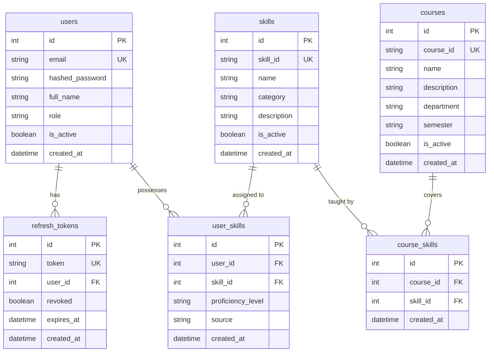
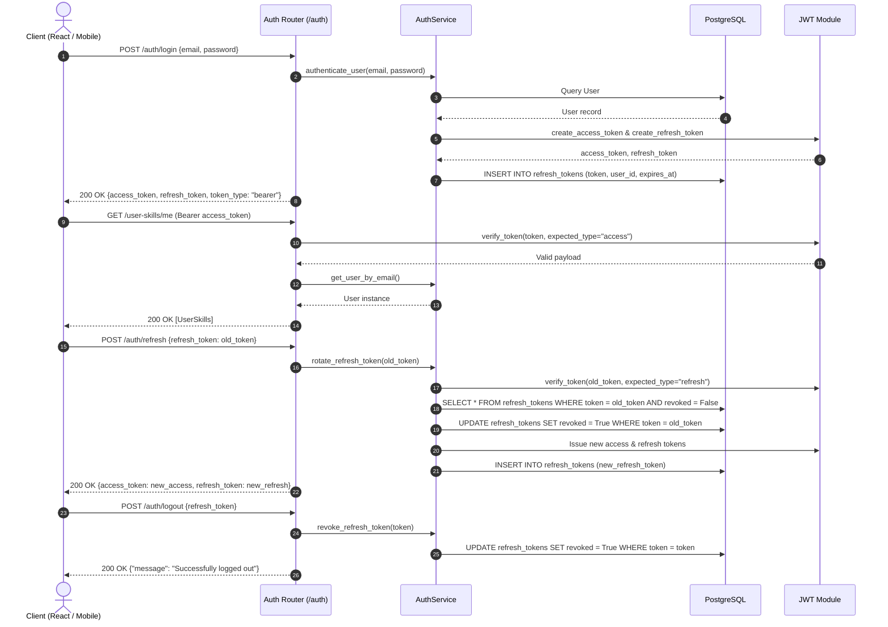

# WorkNexus Backend Architecture Guide

> **Target Audience:** Backend Developers, Machine Learning Engineers, and Frontend Engineers working on the WorkNexus platform.  
> **Status:** Production-Ready Core Foundation (Authentication, Token Rotation, Skills Taxonomy, Curriculum Courses, User Skills, Course-Skill Mapping)  
> **Repository:** `Worknexus` | **Backend Core:** `backend/`

---

## 1. Project Overview

### What is WorkNexus?
WorkNexus is a **Labour Market Intelligence & Curriculum Alignment Platform** designed to solve structural mismatches between vocational training programs, university curricula, and industry hiring requirements. It establishes a closed-loop ecosystem between:
- **Industry & Employers:** Capturing job demands, required skill sets, and missing graduate competencies.
- **Educational Institutes:** Structuring courses, mapping curriculum coverage, and receiving automated alignment recommendations.
- **Students & Jobseekers:** Cataloging verified and declared skill proficiencies.
- **Government Agencies:** Monitoring regional district skill-gap heatmaps, placement indices, and unmet market demand.

### Current Implementation Status
The backend provides a scalable, enterprise-grade architecture:
- **Relational Database:** PostgreSQL 15+ managed via **SQLAlchemy 2.0** (with strict `Mapped[...]` typing) and the high-performance **psycopg3** driver.
- **Database Migrations:** Managed through **Alembic**, versioning `users`, `skills`, `courses`, `user_skills`, `course_skills`, and `refresh_tokens`.
- **Cryptographic Security & Authentication:**
  - Password hashing via **Passlib (bcrypt)** with per-user salting.
  - Dual-token lifecycle: **Access Tokens (30 min)** + **Refresh Tokens (7 days)**.
  - **Token Rotation:** Every token refresh revokes the old refresh token and issues a new pair.
  - **Session Revocation:** Logout explicitly marks the refresh token revoked in PostgreSQL.
  - Separate token types (`access` vs `refresh`) preventing privilege escalation.
- **Cross-Origin Resource Sharing (CORS):** Fully configured in `app/main.py` allowing frontend connections from Vite (`http://localhost:3000`).
- **Layered Architecture:** Clear isolation between API routing, service layer queries, Pydantic validation schemas, and ORM models.

### Tech Stack
| Component | Technology | Version | Purpose |
| :--- | :--- | :--- | :--- |
| **Web Framework** | FastAPI | `0.141.1` | High-performance asynchronous REST API framework |
| **ASGI Server** | Uvicorn | `0.52.4` | ASGI web server |
| **Database** | PostgreSQL | 15+ | Primary relational database |
| **ORM** | SQLAlchemy | `2.0.52` | Declarative 2.0 ORM with typed mappings |
| **DB Driver** | psycopg (psycopg3) | `3.3.5` | Modern PostgreSQL DBAPI driver |
| **Migrations** | Alembic | `1.20.0` | Schema revision versioning |
| **Validation** | Pydantic | `2.13.5` | Schema validation and serialization |
| **Settings** | Pydantic-Settings | `2.15.0` | Environment variable parsing |
| **Password Hashing**| Passlib (bcrypt) | `1.7.4` | Password hashing with automatic salting |
| **JWT Tokens** | python-jose | `3.5.0` | RFC 7519 JSON Web Token issuance and signature verification |
| **Testing** | Pytest + HTTPX | `9.1.1` / `0.28.1` | Unit and end-to-end integration test runner |

---

## 2. Folder Structure & Responsibilities

```text
backend/
├── alembic/                         # Database migration scripts and configuration
│   ├── versions/                    # Migration revision files
│   │   ├── f97f51981d4c_create_users_table.py
│   │   ├── 0507cf69fd83_create_skills_table.py
│   │   └── 861649acb717_create_courses_user_skills_course_.py
│   ├── env.py                       # Alembic migration engine and metadata loader
│   ├── README                       # Alembic environment documentation
│   └── script.py.mako               # Migration template
├── app/                             # Core application package
│   ├── api/                         # HTTP routing layer
│   │   ├── __init__.py              # Router re-exports
│   │   ├── auth.py                  # /auth/register, /login, /token, /refresh, /logout, /me
│   │   ├── skills.py                # CRUD for /skills/
│   │   ├── courses.py               # CRUD for /courses/ and /courses/{id}/skills
│   │   ├── user_skills.py           # CRUD for /user-skills/ and /user-skills/me
│   │   └── course_skills.py         # CRUD for /course-skills/
│   ├── auth/                        # Security and cryptographic primitives
│   │   ├── __init__.py
│   │   ├── dependencies.py          # get_current_user OAuth2 dependency
│   │   ├── jwt.py                   # Access/refresh token creation and verification
│   │   └── security.py              # Bcrypt password hashing
│   ├── db/                          # Database connection and session management
│   │   ├── __init__.py
│   │   ├── base.py                  # SQLAlchemy DeclarativeBase
│   │   ├── database.py              # Engine and SessionLocal factory
│   │   └── dependencies.py          # get_db session dependency
│   ├── models/                      # SQLAlchemy ORM persistent models
│   │   ├── __init__.py              # Re-exports all models
│   │   ├── users.py                 # User table
│   │   ├── skills.py                # Skill table
│   │   ├── courses.py               # Course table
│   │   ├── user_skills.py           # UserSkill association table
│   │   ├── course_skills.py         # CourseSkill association table
│   │   └── refresh_tokens.py        # RefreshToken storage and revocation table
│   ├── schemas/                     # Pydantic validation & serialization schemas
│   │   ├── __init__.py              # Re-exports all schemas
│   │   ├── user.py                  # UserCreate, UserLogin, UserResponse
│   │   ├── token.py                 # Token, TokenRefreshRequest, TokenData
│   │   ├── skill.py                 # SkillCreate, SkillUpdate, SkillResponse
│   │   ├── course.py                # CourseCreate, CourseUpdate, CourseResponse
│   │   ├── user_skill.py            # UserSkillCreate, UserSkillUpdate, UserSkillResponse
│   │   └── course_skill.py          # CourseSkillCreate, CourseSkillResponse
│   ├── services/                    # Business logic and database operations
│   │   ├── __init__.py              # Re-exports all services
│   │   ├── auth_service.py          # User authentication and token rotation logic
│   │   ├── skill_service.py         # Skill taxonomy queries
│   │   ├── course_service.py        # Course management queries
│   │   ├── user_skill_service.py    # User skill profiling logic
│   │   └── course_skill_service.py  # Curriculum-skill mapping logic
│   ├── utils/                       # Shared utility helpers
│   ├── config.py                    # Environment configuration via BaseSettings
│   └── main.py                      # Application factory, middleware & router mounting
├── tests/                           # Unit and integration test suites
│   ├── test_auth_api.py             # Auth endpoints unit tests
│   ├── test_auth_jwt.py             # JWT token issuance & verification tests
│   ├── test_auth_refresh.py         # Token refresh, rotation & revocation tests
│   ├── test_courses_api.py          # Course CRUD unit tests
│   ├── test_user_skills_api.py      # User skills unit tests
│   ├── test_course_skills_api.py    # Course skill mappings unit tests
│   └── test_integration.py         # End-to-end full system flow test against PostgreSQL
├── alembic.ini                      # Alembic CLI runtime configuration
└── requirements.txt                 # Exact pinned dependencies
```

---

## 3. Database Schema



### Table Specifications

#### 1. `users`
- `id` (Integer, PK, Index)
- `email` (String(255), Unique, Indexed, Non-null)
- `hashed_password` (String(255), Non-null)
- `full_name` (String(255), Non-null)
- `role` (String(50), Non-null: `student`, `employer`, `institute`, `admin`)
- `is_active` (Boolean, default `true`)
- `created_at` (DateTime with timezone)

#### 2. `refresh_tokens`
- `id` (Integer, PK, Index)
- `token` (String(500), Unique, Indexed, Non-null)
- `user_id` (Integer, FK `users.id` ondelete CASCADE, Indexed)
- `revoked` (Boolean, default `false`, Non-null)
- `expires_at` (DateTime with timezone)
- `created_at` (DateTime with timezone)

#### 3. `skills`
- `id` (Integer, PK, Index)
- `skill_id` (String(50), Unique, Indexed, Non-null)
- `name` (String(255), Indexed, Non-null)
- `category` (String(100), Indexed, Non-null)
- `description` (String(500), Nullable)
- `is_active` (Boolean, default `true`)
- `created_at` (DateTime with timezone)

#### 4. `courses`
- `id` (Integer, PK, Index)
- `course_id` (String(50), Unique, Indexed, Non-null)
- `name` (String(255), Indexed, Non-null)
- `description` (Text, Nullable)
- `department` (String(100), Indexed, Non-null)
- `semester` (String(50), Nullable)
- `is_active` (Boolean, default `true`)
- `created_at` (DateTime with timezone)

#### 5. `user_skills`
- `id` (Integer, PK, Index)
- `user_id` (Integer, FK `users.id` ondelete CASCADE, Indexed)
- `skill_id` (Integer, FK `skills.id` ondelete CASCADE, Indexed)
- `proficiency_level` (String(50), Non-null, default `beginner`)
- `source` (String(100), Non-null, default `self_reported`)
- `created_at` (DateTime with timezone)
- *Constraint:* `UniqueConstraint("user_id", "skill_id")`

#### 6. `course_skills`
- `id` (Integer, PK, Index)
- `course_id` (Integer, FK `courses.id` ondelete CASCADE, Indexed)
- `skill_id` (Integer, FK `skills.id` ondelete CASCADE, Indexed)
- `created_at` (DateTime with timezone)
- *Constraint:* `UniqueConstraint("course_id", "skill_id")`

---

## 4. Authentication & Token Lifecycle



---

## 5. Service Layer Design

Every business operation is decoupled from FastAPI routing:
- **Routers** handle HTTP requests, schema parsing, dependency injection, and status codes.
- **Services** encapsulate database queries, business validations, transactions, and cryptographic operations.
- All database queries strictly utilize **SQLAlchemy 2.0 explicit `select()` statements**:
  ```python
  stmt = select(Course).where(Course.department == department)
  courses = list(db.execute(stmt).scalars().all())
  ```
- No raw database queries or direct session commits occur in route handlers.

---

## 6. Frontend Integration Points

The React frontend (`frontend/src`) can connect directly to the FastAPI endpoints:

| Feature / UI View | React Component | Target API Endpoint |
| :--- | :--- | :--- |
| **Authentication** | `LoginPage.tsx` | `POST /auth/login` (store access & refresh tokens in secure storage) |
| **Session Refresh** | Axios / Fetch Interceptor | `POST /auth/refresh` on 401 response |
| **Logout** | `Header.tsx` | `POST /auth/logout` |
| **User Profile** | Profile Page | `GET /auth/me` |
| **Skill Autocomplete** | `EmployerPortal.tsx` | `GET /skills/?category=...` |
| **Course Catalog** | `DistrictDetail.tsx` | `GET /courses/?department=...` |
| **Course Skills** | `CourseDetail.tsx` | `GET /courses/{id}/skills` |
| **My Skills** | Student Dashboard | `GET /user-skills/me` & `POST /user-skills/` |

---

## 7. Machine Learning (ML) Integration Points

WorkNexus's planned intelligence workflows hook into the data model:


1. **Skill Extraction Pipeline (`POST /ml/extract-skills`):**
   - Offline or batch NER models parse raw employer job postings and academic syllabi into standardized skill IDs.
2. **Embedding & Gap Computation (`GET /courses/{id}/gap-analysis`):**
   - Compares vector embeddings or coverage metrics between `course_skills` and aggregated industry demand.
   - Calculates the **Alignment Score** ($0-100$) and flags high gaps ($\ge 20\%$).
3. **Personalized Learning Paths (`GET /recommendations/courses`):**
   - Matches a student's `user_skills` deficit against `courses` with high coverage in emerging skills.
